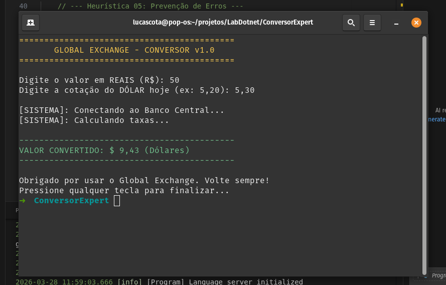

# 🚀 Global Exchange — Conversor de Moeda com UX no Console

## 📖 Sobre o Projeto
Este projeto apresenta um sistema de conversão de moeda desenvolvido em **C#**, com foco na aplicação de conceitos de **Interação Humano-Computador (IHC)** e **Experiência do Usuário (UX)** em um ambiente de console.

A aplicação simula um conversor de Real (R$) para Dólar (USD), incorporando feedback visual, mensagens informativas e tratamento de erros, demonstrando como boas práticas de usabilidade podem ser aplicadas mesmo em aplicações simples.

## 🎯 Objetivos da Atividade
- Aplicar conceitos de UX em aplicações de console
- Demonstrar o uso de tratamento de exceções com `try-catch-finally`
- Trabalhar com entrada e validação de dados do usuário
- Simular feedback de sistema (carregamento e processamento)
- Aplicar heurísticas de Nielsen na prática
- Melhorar a comunicação entre sistema e usuário

## ⚙️ Funcionamento do Sistema
O sistema solicita ao usuário:
- o valor em reais (R$)
- a cotação atual do dólar

Após a entrada:
- simula uma conexão com um sistema externo
- exibe mensagens de status para o usuário
- realiza o cálculo de conversão
- apresenta o resultado formatado

Caso ocorra erro na entrada:
- o sistema captura a exceção
- exibe uma mensagem clara e amigável
- evita o encerramento abrupto do programa

## 🧠 Heurísticas de Nielsen Aplicadas

### 1. Visibilidade do Status do Sistema
O sistema informa constantemente o que está acontecendo através de mensagens como:
- "Conectando ao Banco Central..."
- "Calculando taxas..."

Isso mantém o usuário informado durante todo o processo.

### 5. Prevenção de Erros
O uso de `try-catch` evita que entradas inválidas quebrem o sistema. Em vez disso, o usuário recebe uma mensagem clara orientando como corrigir o erro.

### 8. Estética e Design Minimalista
O resultado final é exibido de forma limpa e destacada, utilizando cores para facilitar a leitura e melhorar a experiência visual.

## 💻 Estrutura Utilizada
- `Console` → entrada e saída de dados
- `try-catch-finally` → tratamento de erros
- `double.Parse()` → conversão de dados
- `Thread.Sleep()` → simulação de processamento
- `Console.ForegroundColor` → destaque visual
- `for` → simulação de carregamento

## ▶️ Execução do Programa
Para executar o projeto:

Compilar:
dotnet build

Executar:
dotnet run

## 📸 Evidência de Execução

Abaixo está o registro de execução do sistema demonstrando:
- entrada de dados
- mensagens de carregamento
- resultado final formatado

## 💡 Boas Práticas Aplicadas
- tratamento de exceções para evitar falhas
- feedback visual constante ao usuário
- mensagens claras e orientadas à experiência do usuário
- uso de cores para melhorar legibilidade
- simulação de processos reais para maior imersão
- aplicação prática de conceitos de IHC

## 🎓 Conclusão
Este projeto demonstra que mesmo aplicações simples de console podem incorporar princípios sólidos de UX. A utilização das heurísticas de Nielsen evidencia a importância de sistemas que comunicam claramente seu estado, previnem erros e apresentam informações de forma objetiva e organizada.

## 👨‍💻 Autor
Lucas Cota  
Estudante de Análise e Desenvolvimento de Sistemas  
Foco em Backend e Engenharia de Software
